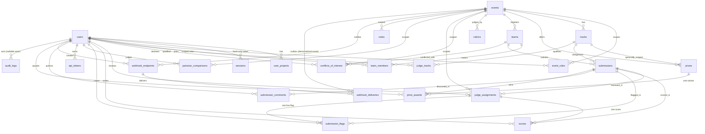

# Schema & Data Model

Source of truth: `src/db/schema.ts` (Drizzle ORM + postgres.js against
PostgreSQL). Migrations in `drizzle/*.sql` are hand-authored to match;
`tests/acceptance/schema.test.ts` fails if a Drizzle column has no matching
migration line. Conventions: `id()` = random UUIDv7-ish primary key via
`uuid("id").defaultRandom().primaryKey()`; `createdAt()` = timestamptz
`created_at` default-now not-null. JSONB columns carry `$type<…>()` shapes.

## Entity-relationship diagram

## Tables

### Identity & access

- **users** — `email` unique not-null; nullable `name` (+ `first_name`,
  `last_name`, `country_code`, `phone_number`, `profession`
  STUDENT|PROFESSIONAL, `country`, `skills` string[] default `[]`,
  `linkedin_url`, `github_url`, `profile_complete` bool); `password_hash`
  (Argon2id, never exported); global `role` (SUPERADMIN|ORGANIZER|JUDGE|
  PARTICIPANT, default PARTICIPANT — only SUPERADMIN is meaningful
  globally); `organization`.
- **user_projects** — showcase links on a profile (`title`, `description`,
  `repo_url`, `hosted_url`); cascade on user delete; index on `user_id`.
- **sessions** — PK is the **SHA-256 hash** of the opaque random token
  (raw token never stored); `user_id` cascade; `expires_at` (7-day TTL);
  index on `user_id`.
- **api_tokens** — long-lived `dfk_`-prefixed Bearer [REDACTED], same
  hash-then-lookup shape as sessions; `name`, unique `token_hash`,
  cleartext `token_prefix` (first 12 chars, display only), `last_used_at`,
  `revoked_at` (soft revoke). Both credential types resolve through the
  same `requireSession()` (`src/server/http.ts`), so RBAC never knows
  which was used.
- **event_roles** — the event-scoped RBAC table: `(event_id, user_id)`
  unique; role ORGANIZER|JUDGE|PARTICIPANT; index on `user_id`.
  `resolveEffectiveRole` returns SUPERADMIN outright, else the mapping,
  defaulting to PARTICIPANT.

### Event & structure

- **events** — `title`, unique `slug`, stored `status` (DRAFT|REGISTRATION|
  SUBMISSION|JUDGING|PUBLIC_VOTING|PUBLISHED — may go stale; the
  **effective** phase always comes from `deriveEventStatus()` over the
  timestamp columns). Phase columns: `registration_end`,
  `submission_start`, `submission_deadline`, `judging_start`,
  `judging_end_time`, `public_voting_start`, `public_voting_end_time`,
  `announcement_date`. Engines: `judges_per_submission` (default 3),
  `double_blind_judging`, `assignment_algorithm` (ROUND_ROBIN|K_COVER),
  `normalization` (RAW_MEAN|Z_SCORE|MIN_MAX|TRIMMED_MEAN). Voting:
  `voting_type` (default SINGLE_CHOICE), `blind_voting`,
  `quadratic_credits` (default 100). Wizard content: `logo/banner/card`
  urls, `website_url`, `description_html`, `format`
  (ONLINE|OFFLINE|HYBRID), location fields, `participation_type`
  (TEAM|INDIVIDUAL), `min/max_team_size` (DB check `min <= max`),
  `audience`, `participation_certificate`.
- **tracks** — per-event categories (`name`, `description`,
  `eligibility_rules` jsonb); cascade on event delete.
- **prizes** — optional `track_id`; `title`, `cash_value` int,
  `kind` (MONETARY|IN_KIND|CERTIFICATE), `currency` default USD.
  Events may have zero prizes.
- **prize_awards** — one winner per prize: `prize_id` unique,
  `submission_id`, `awarded_at`, `awarded_by`.

### Teams & submissions

- **teams** — `event_id` cascade; `name`; `invite_code_hash` ( invites
  are HMAC tokens, hash at rest); nullable `invite_expires_at`
  (null = legacy/never); `is_locked` (roster freeze).
- **team_members** — `(team_id, user_id)` unique; LEADER|MEMBER with a
  **partial unique index enforcing exactly one LEADER per team**;
  `joined_at`.
- **submissions** — `team_id` cascade; nullable `track_id` (drafts start
  trackless; finals always have one); `title` default "Untitled project",
  `tagline`, `description`, `tech_stack` string[], `repo_url`,
  `demo_url`, `asset_keys` (SeaweedFS keys); `is_draft` default true,
  `is_hidden`; `submitted_at`, `updated_at`; index on `team_id`.
- **submission_comments** — Tier-3 discussion: `submission_id` cascade,
  `author_id` set-null on delete, `author_name` default "A voter",
  `body`, `is_hidden` (soft moderation).

### Judging

- **rubrics** — one row per event (`title`, `criteria_json`:
  `[{id, label, weight, minScore, maxScore, kind int|float, step}]`).
- **judge_tracks** — judge↔track qualification, distinct from
  assignments; `(judge_id, track_id)` unique.
- **conflicts_of_interest** — `(judge_id, team_id)` unique + event
  index; reason required.
- **judge_assignments** — `(event_id, judge_id → users (no cascade:
  history survives user deletion), submission_id cascade, status
  default PENDING)`; `(judge_id, submission_id)` unique.
- **scores** — `assignment_id` cascade (unique: one score per
  assignment), denormalized `judge_id` + `submission_id` for query
  scoping; `rubric_scores_json` ({criterionId: number}),
  `raw_total` (= weightedMean at write time), `comment` nullable,
  `submitted_at`.
- **submission_flags** — one live flag per assignment
  (`reason`: PLAGIARISM|OFF_TOPIC|INCOMPLETE|INAPPROPRIATE|OTHER);
  judge-private until publish.
- **pairwise_comparisons** — Bradley-Terry ballots:
  `(event_id, judge_id, winner_submission_id, loser_submission_id)`.

### Voting, audit, operations

- **votes** — `event_id`, `voter_fingerprint` (SHA-256 of
  ip|UA|language|client-hints|userId), `submission_id`,
  `vote_weight` (quadratic cost debited in credits), no unique
  constraint (fingerprint + rate limit carry the integrity).
- **audit_logs** — append-only: `actor_id` nullable,
  `action`, `entity_type`, `entity_id` nullable, `payload_json`.
  Imports use `ON CONFLICT DO NOTHING` here — never upsert.
- **signing_keys** — `kid` PK, `public_key_pem`; private PEM lives on
  disk (`SIGNING_KEY_PATH`), never in this table; `retired_at`
  keeps old signatures verifiable after rotation.
- **webhook_endpoints** — per-event delivery targets (`url`, `secret`
  shown once, `is_active`, `created_by`).
- **webhook_deliveries** — outbox rows with `status`/`attempts`/
  `next_attempt_at`/`lease_until`/`last_error`/`delivered_at`;
  partial unique index dedupes the singleton event types
  (`judging.completed`, `results.published`) per endpoint+event;
  `submission.created` is exempt (fires many times).

## Pure invariants (same file, below the tables)

- `deriveEventStatus()` — effective phase from timestamps vs `now`;
  DRAFT short-circuits; dateless rows fall through to PUBLISHED
  (listings filter those first). Every phase gate recomputes this.
- `canEditSubmission()` — `now <= submissionDeadline`.
- `canRegister()` — REGISTRATION phase and no stronger mapping.
- `validateTeamSize()` — 1 ≤ size ≤ 4.
- `isGalleryVisible()` (`src/lib/gallery.ts`) — finalized, unhidden
  submission of a PUBLISHED-effective event only.
- Math: `weightedMean`, `zScore` (σ=0 → 0), `minMax` (min=max → 50),
  `trimmedMean` (n<5 → plain mean, else drop extremes),
  `bradleyTerryProbability`, `seededOrder` (FNV-1a + mulberry32 +
  Fisher-Yates), invite-token helpers.
